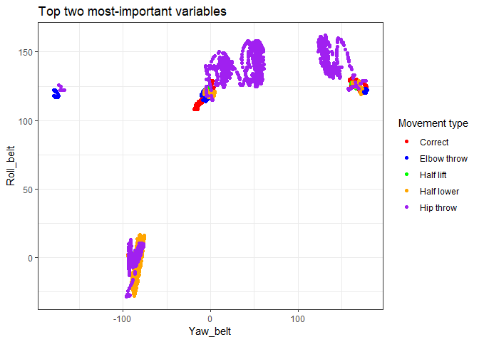

Practical Machine Learning - Weight Lifting Exercise (WLE) prediction
================
L.S.
1 Feb 2019

### Background

It is now becoming commonplace to take note of one's physical activity, with the information provided by novel devices being ideally suited to data mining. One of the most prominent examples of such devices is the FitBit, that records granular, continous data across multiple dimensions of movement. Here, we perform an experiment to classify data from 6 individuals who performed a simple elbow-flexion dumbbell curl in 5 ways. The objective of this study is to identify the type of movement that was performed in a series of blinded testing examples using a machine learning algorithm.

Methods
-------

### The dataset

The dataset presented in this work was distributed under a CC-BY creative commons license from Uglino et al. (2012)(1) and Vellosos et al. (2013)(2). Briefly, the dataset consists of sensor data collected fom 6 participants. Each participant performed a unilateral dumbbell biceps curl in one of 5 ways. The 5 different variations on the curl movement were classified into classes A to E. The classes correspond to:

A. Exactly according to the specification B. Throwing the elbows to the front C. Lifting the dumbbell only halfway D. Lowering the dumbbell only halfway E. Throwing the hips to the front

In order to capture the kinematics of these movements, 4 sensors were placed on each participant. They were asttached to the forearm, upper arm, hips (via a belt), and finally the dumbbell itself. Data at each location were recorded using an accelerometer, a gyroscope, and a magnetometer that recorded the following variables:

1.  Accelerometers: X, Y, and Z acceleration
2.  Gyroscopes: X, Y, and Z rotation
3.  Magnetometer: X, Y and Z heading
4.  Roll, pitch, and yaw

The outputs of these sensors will be input into a random forest classifier implemented in R 3.5 using the randomForest package.

### Data preparation

Relevant R packages are loaded first:

``` r
#If packages are not installed, use install.packages('caret') and/or install.packages('randomForest') and/or install.packages('ggplot2')
library(caret)
library(randomForest)
library(ggplot2)
```

Data output from the sensors consists of &gt;19000 observations of 160 variables. Many of these will be unnecessary, such as `user_name`, and therefore the data will have to be processed prior to analysis. Data are first extracted from `pml_training.csv`:

``` r
#Load data, convert all non-numeric data to NA
allData=read.csv('./pml-training.csv', na.strings=c("", "#DIV/0!", "NA")) 

#Select class labels
allLabels=allData$classe

#Remove demographic and timestamp variables (columns 1 to 7), as well as class labels (the last column)
allData=allData[,-c(1:7, ncol(allData))]

#Select only columns from training data that have no NA values
allData=allData[,which(colSums(is.na(allData))==0)] 
```

Random forests does not require an expicit cross-validation during training, as this technique relies on bootstrap-aggregating (bagging), in which random subsamples are selected from training data. A decision tree is created for each subsample. This repeated sampling with replacement is effectively an implicit cross-validation measure. However, we still need to see how well our algorithm performs prior to testing it on the external validation set data. Thus, we create a data partition to inspect the performance of the classifier after training:

``` r
#Creating a data partition
inTrain=createDataPartition(allLabels, p=0.75)[[1]]

#Defining training and testing data bsed on partition indices
xtrain=allData[inTrain,]
xtest=allData[-inTrain,]

#Splitting Similarly defining training and testing labels using partition indices
trainLabels=allLabels[inTrain]
testLabels=allLabels[-inTrain]
```

Results and discussion
----------------------

Finally, we can train the random forest classifier using the randomForest() function from the randomForest package:

``` r
#'Train a random forest model on the predictors highlighted above
rfMdl=randomForest(xtrain, trainLabels)
```

Now we have a trained ensemble of trees (the default number of trees for randomForest() is n=500), saved as an object named `rfMdl`. We can use this object to predict the class labels of our held-out testing set from before:

``` r
#'Predict based on test set. Note that test-set accuracy is >99.0%
preds=predict(rfMdl, xtest)
accuracy=sum(preds==testLabels)/length(testLabels)
```

Let's inspect the importance of the variables in the trained rfMdl ensemble:

``` r
#Extract the variable importance
varImp=rfMdl$importance

#Sort the variable importance
sortedVarImp=rownames(varImp)
sortedVarImp=sortedVarImp[order(-varImp)]

#Variables sorted by order of importance (Decrease in Gini nodal impurity)

#  [1] "roll_belt"            "yaw_belt"             "pitch_forearm"        "magnet_dumbbell_z"    "pitch_belt"           "magnet_dumbbell_y"   
#  [7] "roll_forearm"         "magnet_dumbbell_x"    "accel_dumbbell_y"     "magnet_belt_y"        "roll_dumbbell"        "magnet_belt_z"       
# [13] "accel_belt_z"         "accel_dumbbell_z"     "accel_forearm_x"      "gyros_belt_z"         "roll_arm"             "magnet_forearm_z"    
# [19] "yaw_dumbbell"         "total_accel_dumbbell" "accel_dumbbell_x"     "magnet_arm_x"         "accel_forearm_z"      "magnet_belt_x"       
# [25] "magnet_arm_y"         "accel_arm_x"          "gyros_dumbbell_y"     "yaw_arm"              "magnet_forearm_x"     "magnet_forearm_y"    
# [31] "total_accel_belt"     "magnet_arm_z"         "pitch_dumbbell"       "yaw_forearm"          "pitch_arm"            "accel_arm_y"         
# [37] "accel_forearm_y"      "gyros_arm_y"          "gyros_dumbbell_x"     "gyros_arm_x"          "accel_arm_z"          "accel_belt_y"        
# [43] "gyros_forearm_y"      "accel_belt_x"         "gyros_belt_y"         "total_accel_forearm"  "gyros_belt_x"         "total_accel_arm"     
# [49] "gyros_forearm_z"      "gyros_dumbbell_z"     "gyros_forearm_x"      "gyros_arm_z"   
```

Note that "roll\_belt" and "yaw\_belt" ended up contributing the most to decrease in node impurity. Now let us create a confusion matrix of the results of the prediction process to quantify how well each class was predicted:

``` r
confMat=confusionMatrix(preds, testLabels)

# Confusion Matrix and Statistics
# 
#           Reference
# Prediction    A    B    C    D    E
#          A 1394    4    0    0    0
#          B    0  945    5    0    0
#          C    1    0  850    3    0
#          D    0    0    0  801    0
#          E    0    0    0    0  901
# 
# Overall Statistics
#                                           
#                Accuracy : 0.9973          
#                  95% CI : (0.9955, 0.9986)
#     No Information Rate : 0.2845          
#     P-Value [Acc > NIR] : < 2.2e-16       
#                                           
#                   Kappa : 0.9966          
#  Mcnemar's Test P-Value : NA              
# 
# Statistics by Class:
# 
#                      Class: A Class: B Class: C Class: D Class: E
# Sensitivity            0.9993   0.9958   0.9942   0.9963   1.0000
# Specificity            0.9989   0.9987   0.9990   1.0000   1.0000
# Pos Pred Value         0.9971   0.9947   0.9953   1.0000   1.0000
# Neg Pred Value         0.9997   0.9990   0.9988   0.9993   1.0000
# Prevalence             0.2845   0.1935   0.1743   0.1639   0.1837
# Detection Rate         0.2843   0.1927   0.1733   0.1633   0.1837
# Detection Prevalence   0.2851   0.1937   0.1741   0.1633   0.1837
# Balanced Accuracy      0.9991   0.9973   0.9966   0.9981   1.0000
```

Performance across all classes was generally quite good, with class-wise accuracies only ranging between 99.7% and 100.0%. Therefore, we can expect that the out-of-sample error will be well-approximated as 1.0-0.9973=0.0027, or 0.27%.

Finally let us inspect the two most important variables as chosen by the random forests algorithm, by scatter-plotting them against each other:

``` r
df=as.data.frame(cbind(roll=xtrain$roll_belt, yaw=xtrain$yaw_belt, trainLabels))

ggplot(data=df, aes(x=yaw, y=roll, color=factor(trainLabels)))+
  geom_point()+
  labs(title="Top two most-important variables", x="Yaw_belt", y="Roll_belt", color="Movement type")+
  scale_colour_manual(labels=c("Correct", "Elbow throw", "Half lift", "Half lower", "Hip throw"),  
                      values=c("1"="red", "2"="blue", "3"="green", "4"="orange", "5"="purple"))+
  theme_bw()
```



Note that that there is a visual separation already starting to take place, although it is clear that other variables are necessary to facilitate classification, given the considerable overlap of the data points. The decrease in Gini impurity was greatest for the variable "roll\_belt" in the variable importance analysis, and it is clear that there is a separate cluster of low-roll and low-yaw cases consisting largely of class "D" and class "E" observations (half-lowering of the dumbbell and hip-throwing, respectively).

Predicting results of naive test cases (i.e. external validation set)
---------------------------------------------------------------------

Finally, we consider the performance of the model on the extrernal test set provided for evaluation. The results are as follows:

``` r
#'Process data in the same way as the training-and-testing set, above. 
#'Load data, convert all non-numeric data to NA

validationData=read.csv('./pml-testing.csv', na.strings=c("", "#DIV/0!", "NA")) 

#Remove demographic and timestamp variables (columns 1 to 7), as well as the "problem_id" (the last column)
validationData=validationData[,-c(1:7, ncol(validationData))]

#Select only columns from validation data that have no NA values
validationData=validationData[,which(colSums(is.na(validationData))==0)] 

#Predict validation labels
validPreds=predict(rfMdl, validationData)
 
#  1  2  3  4  5  6  7  8  9 10 11 12 13 14 15 16 17 18 19 20 
#  B  A  B  A  A  E  D  B  A  A  B  C  B  A  E  E  A  B  B  B 
# Levels: A B C D E
```

References
----------

1.  Ugulino, W.; Cardador, D.; Vega, K.; Velloso, E.; Milidiu, R.; Fuks, H. Wearable Computing: Accelerometers' Data Classification of Body Postures and Movements. Proceedings of 21st Brazilian Symposium on Artificial Intelligence. Advances in Artificial Intelligence - SBIA 2012. In: Lecture Notes in Computer Science. , pp. 52-61. Curitiba, PR: Springer Berlin / Heidelberg, 2012. ISBN 978-3-642-34458-9. DOI: 10.1007/978-3-642-34459-6\_6

2.  Velloso, E.; Bulling, A.; Gellersen, H.; Ugulino, W.; Fuks, H. Qualitative Activity Recognition of Weight Lifting Exercises. Proceedings of 4th International Conference in Cooperation with SIGCHI (Augmented Human '13) . Stuttgart, Germany: ACM SIGCHI, 2013.
